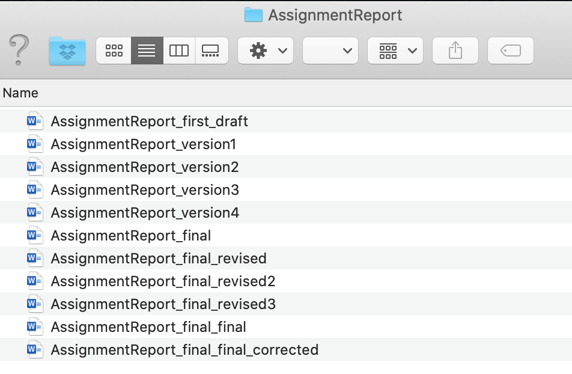
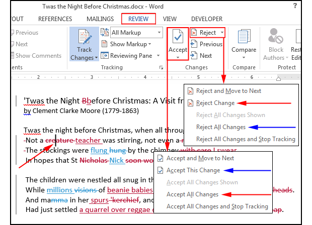
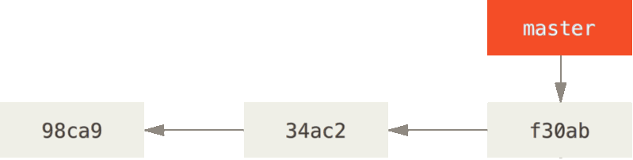
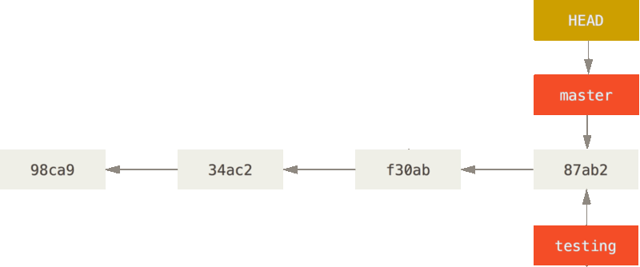

```{r setup, include=FALSE, cache=FALSE}
options(htmltools.dir.version = FALSE, width=80)
knitr::opts_chunk$set(warning = FALSE, message = FALSE, cache=TRUE)

## from http://yihui.name/knitr/hooks#chunk_hooks
knitr::knit_hooks$set(small.mar=function(before, options, envir) {
                                              if (before) par(mar=c(4, 5, 1, 1)) ## smaller margin on top and right
})
```

class: title-slide, middle, center

# Version control and social coding

## Robert Castelo
[robert.castelo@upf.edu](mailto:robert.castelo@upf.edu)
### Dept. of Experimental and Health Sciences
### Universitat Pompeu Fabra

<br>

## Fundamentals of Computational Biology
### BSc on Human Biology
### UPF School of Health and Life Sciences
### Academic Year 2021-2022

---

## Document versioning

* Document versioning: keeping different versions of the same document.  
  &nbsp;&nbsp;
* Using multiple files with different names is often the way to keep different
  versions of the same document.  
  &nbsp;&nbsp;
* Following up the most recent version of a document or recovering a specific
  version becomes difficult and error prone.

.pull-left[]
.pull-right[]

.footer[
Right image from [xkcd](https://xkcd.com/1459)
]


---

## Document comparison

* We may want to keep track not only of our own edits but of the edits of
  other individuals on the same document.  
  &nbsp;&nbsp;
* Current word processing software incorporates automatic ways of
  [document comparison](https://en.wikipedia.org/wiki/Document_comparison)
  that allows one to keep track of how the document is being edited and
  eventually accept or reject those edits.



.footer[
Image from "How to track changes in Microsoft Word without going insane".
[PC World, Feb 4, 2015](https://www.pcworld.com/article/2861859/how-to-track-changes-in-microsoft-word-without-going-insane.html)]

---

## Version control systems (VCS)


* In software development, projects can involve a very large number
  of files, which change constantly as a result of that process.  
  &nbsp;&nbsp;
* To handle different versions of files and their concurrent alterations,
  software tools called
  [version control systems (VCS)](https://en.wikipedia.org/wiki/Version_control)
  have been developed.  
  &nbsp;&nbsp;
* VCS provide two fundamental features:
  1. Track changes on files over time with the possibility of reverting to
     earlier versions.
  2. Manage changes and conflicts introduced by multiple individuals on the
     same files.
* There are different VCS, which can be classified in centralized and
  distributed. Some of the most well-known are:
  * [CVS](https://en.wikipedia.org/wiki/Concurrent_Versions_System)
  * [SVN](https://en.wikipedia.org/wiki/Apache_Subversion)
  * [Git](https://en.wikipedia.org/wiki/Git)
  * [Mercurial](https://en.wikipedia.org/wiki/Mercurial)

---

## Centralized VCS


* A centralized VCS, such as CVS or SVN, keeps a database in a single remote
  computer server, which records all changes to files.  
  &nbsp;&nbsp;
* If the computer server storing the database goes down you cannot use the
  system and if it breaks, you loose everything.  


.footer[
Fig. 2 from [S. Chacon and B. Straub. _Pro Git_, Apress](https://git-scm.com/book/en/v2).
]

---

## Distributed VCS

* A distributed VCS, such as Git or Mercurial, keeps the whole database of
  changes to files in every computer from where you use the system.  
  &nbsp;&nbsp;
* To synchronize changes with other collaborators you can use one or more
  remote computer servers, where all, the remote servers and each collaborator,
  keeps the whole version database.


.footer[
Fig. 3 from [S. Chacon and B. Straub. _Pro Git_, Apress](https://git-scm.com/book/en).
]

---

## The Git VCS

* The [Git](https://en.wikipedia.org/wiki/Git) VCS was created in 2005 by
  [Linus Torvalds](https://en.wikipedia.org/wiki/Linus_Torvalds), the original
  developer of the [Linux kernel](https://en.wikipedia.org/wiki/Linux_kernel),
  to help managing the changes to the files forming the Linux kernel software.  
  &nbsp;&nbsp;
* The main features of Git are:
  * Speed.
  * Scalability.
  * Branching.
* Git takes a snapshot of all the files under version control, each time you
[commit](https://en.wikipedia.org/wiki/Commit_%28version_control%29) a change. Versions
can be seen as a stream of commit snapshots.


.footer[
Fig. 5 from [S. Chacon and B. Straub. _Pro Git_, Apress](https://git-scm.com/book/en).
]

---

## Basic concepts of Git

* To put a directory under version control with Git, creating a so-called _Git repository_
  or _Git repo_, you enter that directory and type `git init` **once**:
  <pre>
  $ mkdir project
  $ cd project
  $ git init
  Initialized empty Git repository in /Users/robert/project/.git/
  $ ls -aF
  ./    ../   .git/ 
  $ ls .git
  HEAD        description info        refs
  config      hooks       objects
  </pre>
* Any existing files or directories, or newly created ones, will also go under Git
  version control. The database of changes is stored in the (hidden) directory `.git`.

---

## Basic concepts of Git

* A file under version control with Git is in one out of three possible states:
  * **Modified**: file has changed, but is still not marked it for recording
    that change.
  * **Staged**: a modified file that is marked.
  * **Commited**: a previously marked file that has been copied into the
    database.
* To put files and directories, or their modifications, under version control
  you need to _stage them_ and _commit them_.  
  &nbsp;&nbsp;
* To _stage_ files you use the `add` command to mark modified files:
  <pre>
  git add filenames
  </pre>
* If you want to stage every modified file, then from the top of the git repo, type:
  <pre>
  git add .
  </pre>
* To _commit_ files you type:
  <pre>
  git commit -m 'Update on xxx.'
  </pre>

---

## Basic concepts of Git


* To remove files and directories, you remove them using the Unix `rm` command
  and then _stage_ those changes with:
  <pre>
  $ git add .
  </pre>
* To check the status of files in a git repo you can use the `status` command:
  <pre>
  $ git status
  On branch master
  No commits yet
  nothing to commit (create/copy files and use "git add" to track)
  </pre>
* To browse through the list of commits in a git repo you can use the `log`
  command:
  <pre>
  $ git log
  </pre>
* These and other basic Git commands and concepts are explained in depth
  in the
  [Git Pro](https://git-scm.com/book/en/Git-Basics-Getting-a-Git-Repository)
  book.

---

## Git branching

* Git records commit snapshots by keeping track of which commits came after each other.


.footer[
Fig. 10 from [S. Chacon and B. Straub. _Pro Git_, Apress](https://git-scm.com/book/en).
]

---

## Git branching

* A branch is a pointer to one commit. There is at least a default branch, until recently
called `master`, which points to the last commit made.



<pre>
$ git status
On branch master
No commits yet
nothing to commit (create/copy files and use "git add" to track)
</pre>

.footer[
Adapted from Fig. 12 from [S. Chacon and B. Straub. _Pro Git_, Apress](https://git-scm.com/book/en).
]

---

## Git branching

* You can add a branch, for instance, to test a new feature in your software.
  This is how we would create a branch called `testing` for such a purpose:
  <pre>
  $ git branch testing
  </pre>


.footer[
Fig. 12 from [S. Chacon and B. Straub. _Pro Git_, Apress](https://git-scm.com/book/en).
]

---

## Git branching

* The current branch `master`, where you can _stage_ and _commit_ changes, is
  selected by a special pointer called `HEAD`.


.footer[
Fig. 13 from [S. Chacon and B. Straub. _Pro Git_, Apress](https://git-scm.com/book/en).
]

---

## Git branching

* We can switch from the current branch `master` to the one created called
  `testing` by doing:
  <pre>
  $ git checkout testing
  </pre>


.footer[
Fig. 14 from [S. Chacon and B. Straub. _Pro Git_, Apress](https://git-scm.com/book/en).
]

---

## Git branching

* In the `testing` branch we modify files and we may want to commit those
  changes. When we do that, the currently selected branch `testing` moves
  forward.
  <pre>
  $ git add .
  $ git commit -m 'Added new feature'
  </pre>


.footer[
Fig. 15 from [S. Chacon and B. Straub. _Pro Git_, Apress](https://git-scm.com/book/en).
]

---

## Git branching

* If we are happy with the changes we have made in the `testing` branch, we may
  want to _merge_ them into the default branch `master`.  
  &nbsp;&nbsp;
* We should first switch back to the `master` branch. Such an action will revert
  the files in the working directory back to the snapshot that the `master`
  branch points to.
  <pre>
  $ git checkout master
  </pre>


.footer[
Fig. 16 from [S. Chacon and B. Straub. _Pro Git_, Apress](https://git-scm.com/book/en).
]


---

## Git branching

* Finally, to merge the changes from the `testing` branch into the default
  `master` branch we should use the following command.
  <pre>
  $ git merge testing
  </pre>



* We may want to delete the `testing` branch as follows.
  <pre>
  $ git branch -d testing
  </pre>

---

## Social coding with GitHub

* [GitHub](https://github.com) is a company providing hosting services for
  software development using the Git VCS since 2008. In 2018, GitHub was
  acquired by [Microsoft](https://microsoft.com).  
  &nbsp;&nbsp;
* GitHub provides
  [social media-like features](https://guides.github.com/activities/socialize)
  that allow users to do different kinds of interactions, such as:
  * Open **issues** in a repository to report bugs, ask questions or request new features.
  * **Fork** a repository from a different user to introduce your own changes.
  * Use **pull requests** to propose changes to files in the repository.
  * **Watch** changes in a repository.
  * **Follow** updates from other users.
  * **Stargaze** repositories from other users.
* According to its [Wikipedia page](https://en.wikipedia.org/wiki/GitHub),
  GitHub has as of April 2020, over 40 million users and more than 190 million
  repositories, making it the largest host of source code in the world.

---

## GitHub and the default branch

* The **default** branch is considered the "base" branch in a repository,
  against which all pull requests and code commits are automatically made,
  unless a different branch is specified.  
  &nbsp;&nbsp;
* Following the original git implementation, the default branch at GitHub was
  called **master**.  
  &nbsp;&nbsp;
* On past October 1st, 2020, GitHub started to
  [rename](https://github.com/github/renaming) the default branch from _master_
  to **main** to use a more inclusive term that avoids any association with
  slavery. You can read more about this in the article
  _Tech Confronts Its Use of the Labels ‘Master’ and ‘Slave’_, published in
  June 2020 in the
  [_Wired_ magazine](https://www.wired.com/story/tech-confronts-use-labels-master-slave).  
  &nbsp;&nbsp;
* When creating a new repository in GitHub, the system is going to propose you
  to use **main** as the default branch.

---

## Concluding remarks

* Version control allows you to keep track of your own changes and revert to a
  previous version of them, if necessary.  
  &nbsp;&nbsp;
* Distributed version control systems such as Git facilitate working with
  multiple concurrent, convergent or divergent versions of the same files
  through its branching capabilities.  
  &nbsp;&nbsp;
* Using a remote repository in GitHub enables social coding features that
  facilitate and speed up team work.  
  &nbsp;&nbsp;
* Git and GitHub have become an academic and industry standard for hosting
  software development and distribution. Knowing how to use them is an
  increasingly appreciated skill in both, the academic and the industry
  environments.
