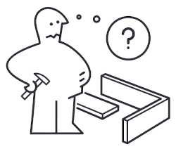

```{r setup, include=FALSE, cache=FALSE}
options(htmltools.dir.version = FALSE, width=80)
knitr::opts_chunk$set(warning = FALSE, message = FALSE, cache=TRUE)

## from http://yihui.name/knitr/hooks#chunk_hooks
knitr::knit_hooks$set(small.mar=function(before, options, envir) {
                                              if (before) par(mar=c(4, 5, 1, 1)) ## smaller margin on top and right
})
```

class: title-slide, middle, center

# Programming with Python (1)

## Robert Castelo
[robert.castelo@upf.edu](mailto:robert.castelo@upf.edu)
### Dept. of Medicine and Life Sciences
### Universitat Pompeu Fabra

<br>

## Fundamentals of Computational Biology
### BSc in Biomedical Sciences
### UPF School of Medicine and Life Sciences
### Academic Year 2025-2026

---

## What's an algorithm

* **Action**: an event that takes place in a finite period of time and produces
  an expected and well-defined result.  
  &nbsp;&nbsp;
--

* **Information**: anything we can observe or find out about an action.  
  &nbsp;&nbsp;
--

* **State**: the information available at a given time point.  
  &nbsp;&nbsp;
--

* **Algorithm**: sequence of actions starting at an initial state and ending at
  an end state, in which we obtain the result.
--

[](img/gestiocasoscovid19.png)
.footer[
[Gestió de casos COVID-19 als centres educatius](https://documents.espai.educacio.gencat.cat/IPCNormativa/Protocol-Gestio-casos-rev.pdf),
Dept. de Salut, Generalitat de Catalunya, 9 de setembre de 2020.
]

---

## What's a software program

* Building an algorithm consists of (1) discovering which elementary actions have
  to occur and (2) how they should be organised throughout time, to obtain the
  result.  
  &nbsp;&nbsp;
--

* Such an exercise requires:
  * Ability for **abstract thought** and **procedural abstraction** at
    different levels.
  * Using a language with precise syntax and notation.
  * Problem solving.
* **Abstraction:** focus attention on the main problem, ignoring
  lower-level details.  
  &nbsp;&nbsp;
* **Procedural abstraction:** understand what a procedure should do
  without knowing exactly it how does it.  
  &nbsp;&nbsp;
--

* Writing a software program is **implementing** an algorithm in a
  specific programming language.

---

## Literals, constants and variables


* [Literal](https://en.wikipedia.org/wiki/Literal_%28computer_programming%29):
  value that does not change over time, e.g.:  
  <pre>
  3.1416, 1, 2, 3, "Hello World!", ...
  </pre>
* [Constant](https://en.wikipedia.org/wiki/Constant_%28computer_programming%29):
  named literal, a value that does not change over time but which we refer to it
  by a given name, typically written in upper case letters, e.g.:  
  <pre>
  PI, A, B, C, ...
  </pre>
* [Variable](https://en.wikipedia.org/wiki/Variable_%28computer_science%29):
  named container storing a value, which may change over time, e.g.:  
  <pre>
  x, y, z, i, j, k, ...
  </pre>
* Constant and variable names should consist of letters and/or digits, but
  they should not start with a digit. Underscores are allowed. E.g.:  
  <pre>
  x1, y1, A4, result2, sum_of_squares, ...
  </pre>

---

## Assignments

* [Assignment](https://en.wikipedia.org/wiki/Assignment_%28computer_science%29):
  statement that sets the value of a variable using an operator, `=` in Python,
  for instance:  
  <pre>
  x = 1
  x = 2
  </pre>
* In an assignment, the left-hand side of the assignment operator is always a
variable, while the right-hand side is what we want to assign into the variable.


---

class: small-table

## Expressions

* [Expression](https://en.wikipedia.org/wiki/Expression_%28computer_science%29):
  syntactically correct specification of one or more operations over any given
  set of literals, constants, variables or functions. E.g.:  
  <pre>
  1 + 1
  x + 2
  y / 2
  </pre>
* The right-hand side of an assignment can be an expression:  
  <pre>
  x = x + 1
  y = ( log(100) - x ) / 3
  </pre>
* Arithmetic operators

|   Operator           |  Example  |  Result |
|--------------------- | :-------: | :-----: |
| addition             |   2 + 2   |    4    |
| subtraction          |   3 - 2   |    1    |
| multiplication       |   3 * 2   |    6    |
| division (quotient)  |   6 / 3   |    2    |
| division (remainder) |   6 % 4   |    2    |

---

## Control flow

* When we run an algorithm, there is a flow of actions being executed after
  one another.  
  &nbsp;&nbsp;
* The course of the flow of execution depends on the so-called
  [control flow](https://en.wikipedia.org/wiki/Control_flow) statements.  
  &nbsp;&nbsp;
* There are three main types of control flow statements:
  * Sequential: actions are executed in a particular order.  
    &nbsp;&nbsp;
  * Conditional: one or more actions are executed only under a specific
    condition.  
    &nbsp;&nbsp;
  * Iterative: one or more actions are executed multiple times until a specific
    condition is met.  
  &nbsp;&nbsp;
* In the next slides we will be using Python syntax to illustrate these
  control flow statements.

---

class: small-table

## Control flow

* Comparison operators: operators that compare two values and return a truth value,
either `true` or `false`.

|    Description        |  Operator |
|---------------------- | :-------: |
|     equality          |    ==     |
|    inequality         |    !=     |
|    greater than       |    >      |
|    smaller than       |    <      |
| greater or equal than |    >=     |
| smaller or equal than |    <=     |
* `2 > 1` is `true`.  
  &nbsp;&nbsp;
* `2 < 1` is `false`.  
  &nbsp;&nbsp;
* `x > 0` will be `true` or `false` depending on the actual value of `x`.

---

## Control flow

* Sequential control flow:  
  <pre>
  a = 2
  b = a
  b = b + a * 4
  print(b)
  </pre>
* The `print(b)` instruction will print the value of `b` in the terminal window.
Think about what value is going to print in the previous code and in each of the
two code blocks below.
  <pre>
  a = 2
  b = a
  print(b)
  b = b + a * 4
  </pre>
  <pre>
  a = 2
  print(b)
  b = a
  b = b + a * 4
  </pre>

---

## Control flow

* Conditional control flow, also known as an "if statement":  
  <pre>
  a = 4
  b = 7
  c = (a * b) + 1
  &nbsp;&nbsp;
  if a % 2 == 0 :
    print("even")
  else :
    print("odd")
  </pre>
* Code blocks associated with an `if` statement are defined by
  [whitespace](https://en.wikipedia.org/wiki/Whitespace_character)
  characters beginning each line of the associated code block. This
  is known in computer programming as
  [indentation](https://en.wikipedia.org/wiki/Indentation_style).
  Other programming languages (e.g.,
  [C](https://en.wikipedia.org/wiki/C_%28programming_language%29),
  [Perl](https://en.wikipedia.org/wiki/Perl)
  or [JavaScript](https://en.wikipedia.org/wiki/JavaScript)) use
  curly braces, `{` and `}`, to define code blocks.  
  &nbsp;&nbsp;
* Programming languages, such as Python, which use indentation
  to define code blocks are said to adhere to the
  [off-side rule](https://en.wikipedia.org/wiki/Off-side_rule).  

---

## Control flow

* Conditional control flow, also known as an "if statement":  
  <pre>
  a = 4
  b = 7
  c = (a * b) + 1
  &nbsp;&nbsp;
  if a % 2 == 0 :
    print("even")
  else :
    print("odd")
  </pre>
* What is going to print on the terminal window the previous
  Python code "even" or "odd"?

---

## Control flow

* Iterative control flow, also known as a "while statement" or "loop":
  <pre>
  i = 0
  s = 0
  while i < 10 :
    i = i + 1
    s = s + i
  &nbsp;&nbsp;
  print(s)
  <pre>
* What is it doing the previous code block with respect to the variable `s`?

---

## Problem solving

* Problem:  
  &nbsp;&nbsp;
  _"Write a program in Python that sums the first 10 natural numbers."_  
  &nbsp;&nbsp;
--
  _"Write a program in Python that calculates the incidence of COVID19."_  
  &nbsp;&nbsp;
--
  _"Write a program in Python that finds DNA mutations associated with cancer."_  
  &nbsp;&nbsp;
--
.pull-left[
  _"Write a program in Python that stiches together data collected from
  telescopes around the globe to produce an image of a black hole."_

  .footer[
  Image from an article in the New York Times in Spanish at  
  https://www.nytimes.com/es/2019/04/15/espanol/katie-bouman-agujero-negro.html
  ]
]
.pull-right[

]

---

## Problem solving

* Problem:  
  &nbsp;&nbsp;
  _"Write a program in Python that sums the first 10 natural numbers."_

--

.pull-left[

]
.pull-right[

]

--



---

## Problem solving

* Problem:  
  &nbsp;&nbsp;
  _"Write a program in Python that sums the first 10 natural numbers."_

.pull-left[

]
.pull-right[

]


---

## Problem solving

* Problem:  
  &nbsp;&nbsp;
  _"Write a program in Python that sums the first 10 natural numbers."_  

.pull-left[

]
.pull-right[

]

--

* To figure out an algorithm, which you will end up writing it up as a
  program in Python, **you need first to come up with an schematic diagram**.

---

## Problem solving

* Problem:  
  &nbsp;&nbsp;
  _"Write a program in Python that sums the first 10 natural numbers."_  
  &nbsp;&nbsp;
* Schematic diagram:


---

## Problem solving

* Implementation of the schematic diagram:
  <pre>
  i = 0  ## initial condition: should happen before looping
  s = 0  ## initial condition: should happen before looping
  while i < 10 : ## final condition: should not happen when looping
    i = i + 1    ## invariant condition: always happens when looping
    s = s + i    ## invariant condition: always happens when looping
  &nbsp;&nbsp;
  print(s)
  <pre>

---

## Concluding remarks

* Spaces ([indentation](https://en.wikipedia.org/wiki/Indentation_style))
  and newlines are important in Python to define control flow statements.  
  &nbsp;&nbsp;
--

* Syntax must be precise, otherwise we will encounter **syntax errors**.  
  &nbsp;&nbsp;
--

* Syntax errors are straightforward to correct, conceptual errors (when we
  do not obtain the right result) are much more difficult. We need to solve
  the problem correctly.  
  &nbsp;&nbsp;
--

* **Problem solving is key to learn programming**.  
  &nbsp;&nbsp;
--

* The right way to tackle a problem is to come up with an **schematic diagram**
  on paper, blackboard, etc.  
  &nbsp;&nbsp;
--

* There will be always a problem that is difficult enough for us that we will not
  be able to solve it correctly without an **schematic diagram**.  
  &nbsp;&nbsp;
--

* **The only way to learn problem solving is by solving problems**.
